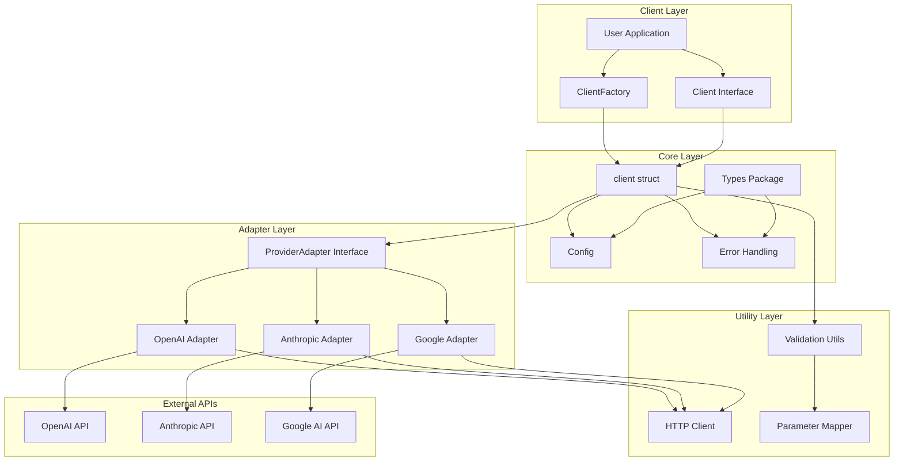
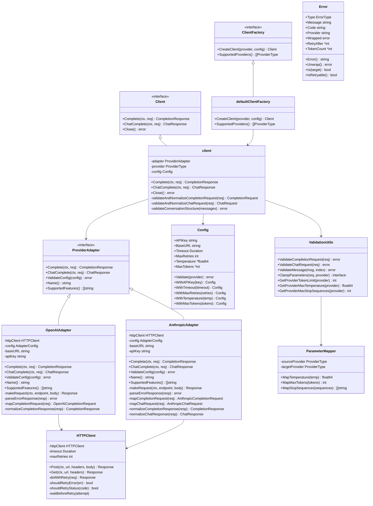
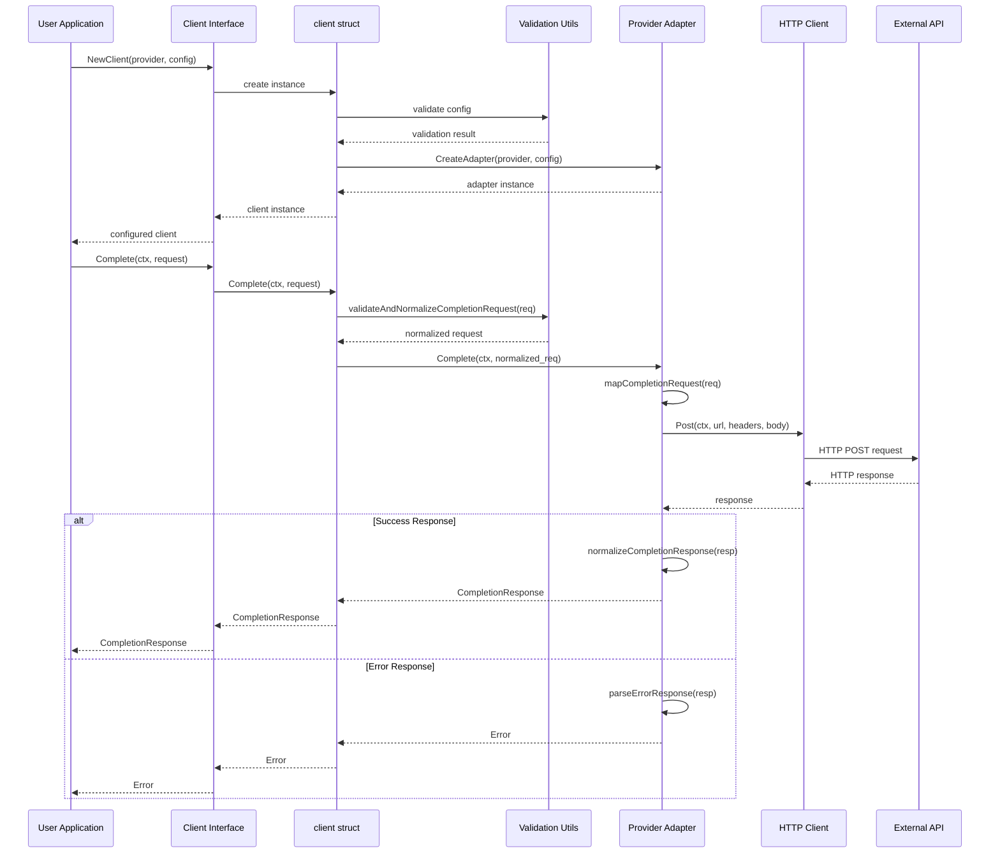
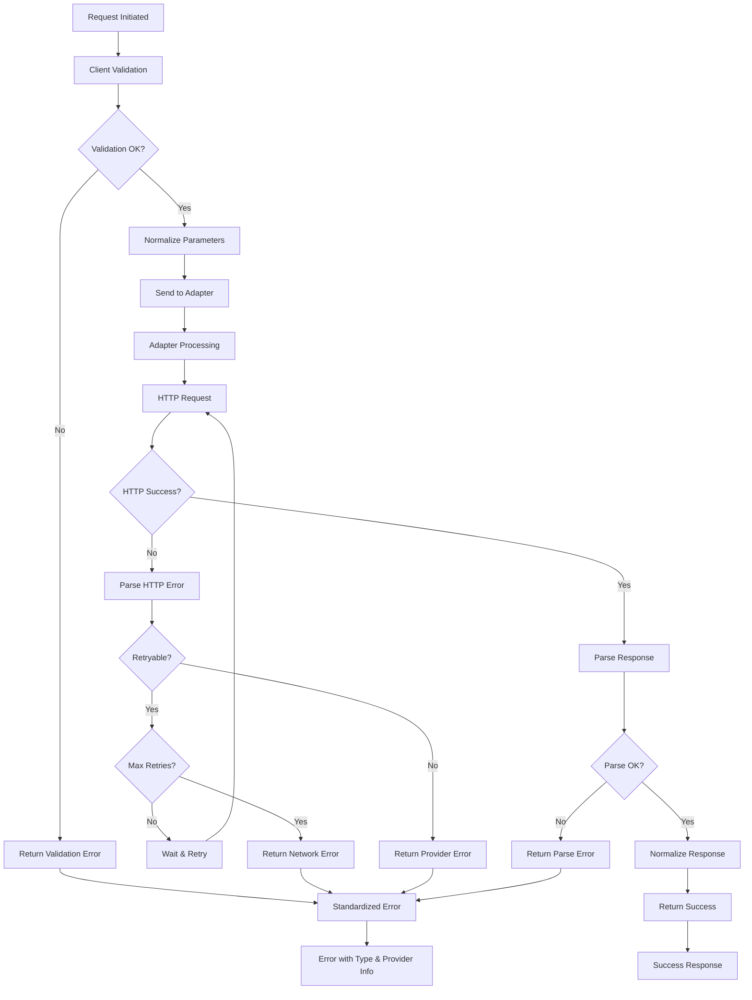
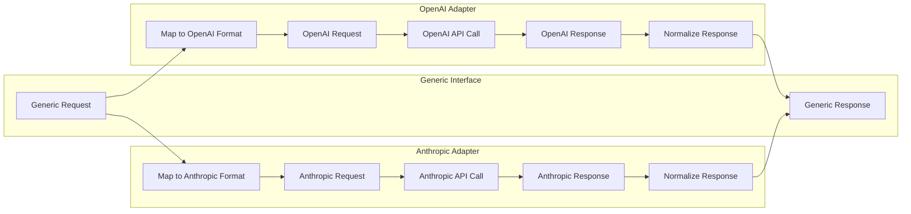
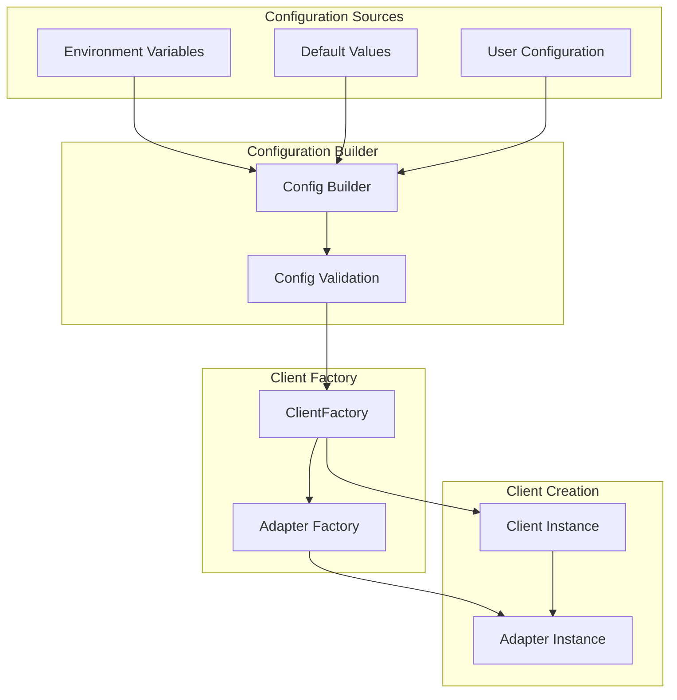
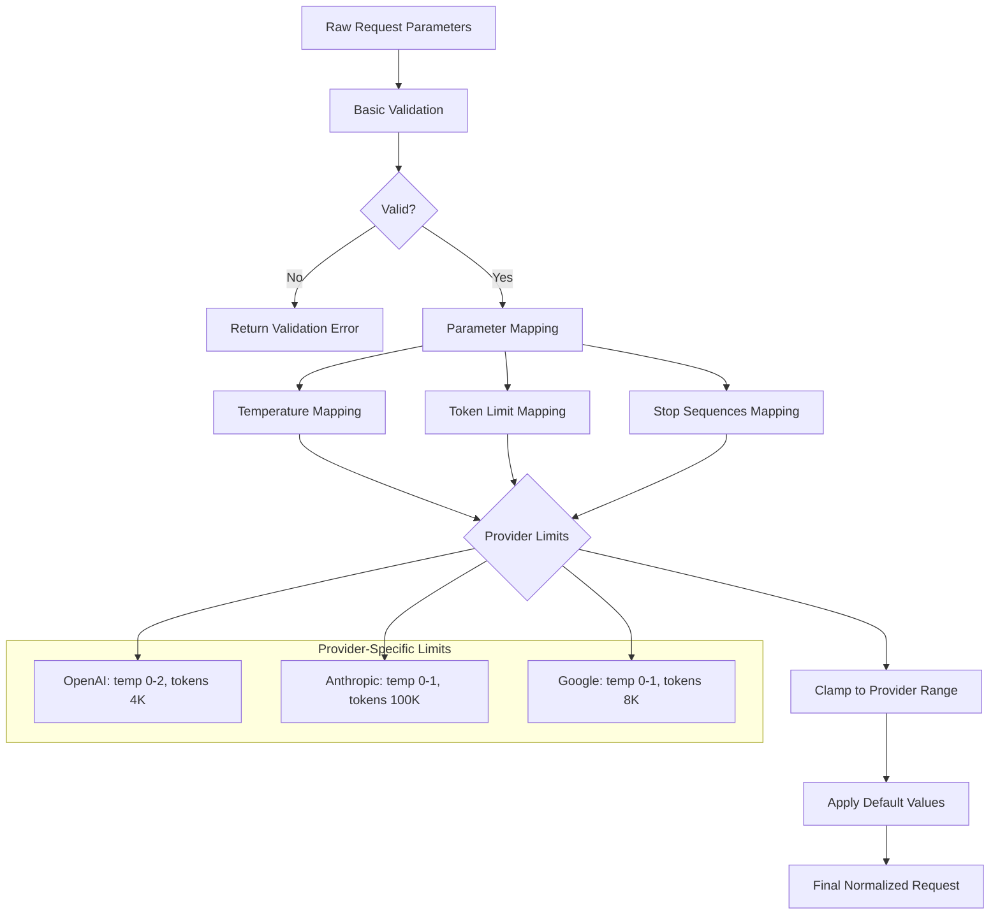

# AI Provider Wrapper - Architecture Diagram

This document contains class interaction diagrams that illustrate the architecture and code flow of the AI Provider Wrapper.

## High-Level Architecture Overview

## Detailed Class Diagram

## Request Flow Sequence Diagram

## Error Handling Flow

## Provider Adapter Pattern

## Configuration and Factory Pattern

## Parameter Mapping and Validation

## Key Design Patterns

### 1. Adapter Pattern
- **Purpose**: Allows different AI providers to work with a unified interface
- **Implementation**: Each provider has its own adapter that implements `ProviderAdapter`
- **Benefits**: Easy to add new providers, consistent API across providers

### 2. Factory Pattern
- **Purpose**: Creates clients and adapters based on provider type
- **Implementation**: `ClientFactory` and adapter creation functions
- **Benefits**: Centralized creation logic, easy testing and dependency injection

### 3. Strategy Pattern
- **Purpose**: Different validation and parameter mapping strategies per provider
- **Implementation**: Provider-specific validation and parameter clamping
- **Benefits**: Flexible parameter handling, provider-specific optimizations

### 4. Decorator Pattern
- **Purpose**: Adds validation, normalization, and error handling around core functionality
- **Implementation**: Client wraps adapters with additional functionality
- **Benefits**: Separation of concerns, consistent behavior across providers

## Code Flow Summary

1. **Client Creation**:
   - User calls `NewClient()` or factory methods
   - Configuration is validated and normalized
   - Appropriate adapter is created based on provider type
   - Client instance wraps the adapter

2. **Request Processing**:
   - User calls `Complete()` or `ChatComplete()`
   - Client validates and normalizes request parameters
   - Request is passed to provider-specific adapter
   - Adapter maps generic request to provider format

3. **API Communication**:
   - Adapter makes HTTP request using shared HTTP client
   - HTTP client handles retries and error conditions
   - Response is parsed and error-checked

4. **Response Processing**:
   - Adapter normalizes provider response to generic format
   - Response is returned through the client interface
   - Errors are standardized and categorized

5. **Error Handling**:
   - All errors are wrapped in standardized `Error` type
   - Error types enable consistent retry logic
   - Provider-specific error codes are preserved

This architecture provides a clean separation of concerns, making it easy to add new providers while maintaining a consistent API for users.